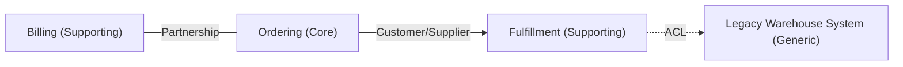

# DDD Context Map

## Why this exists

Requirements documents describe *what* a system must do, spread flat across dozens of REQ-IDs. They don't say *where the seams are* — which requirements belong to the same coherent piece of business logic, which belong to a neighboring but distinct one, and how those pieces should talk to each other once they're separated. Get that slicing wrong and you end up with a "God module" that owns half the domain, or a set of services so entangled that changing one always breaks another.

Strategic Domain-Driven Design exists to make that slicing decision explicit and defensible. A Bounded Context is a boundary within which a specific domain model and its vocabulary (the "ubiquitous language") stay consistent — the same term (e.g. "Customer") can legitimately mean something different in the Billing context than in the Support context, and that's fine as long as the boundary between them is drawn deliberately, not accidentally. A context map then documents how those contexts actually relate to each other in practice: who depends on whom, who's upstream, who has to translate.

Take on the mindset of a domain-driven design practitioner running an informal Context Mapping / Event-Storming-style analysis: look for where vocabulary shifts, where a group of requirements clusters around one actor or business capability, and where two clusters only touch through a narrow, well-defined interface.

## Input expectations

This skill works best on requirements that carry stable IDs (`REQ-001`, ...) — either a requirements table (see the `requirements-engineering` skill) or a functional specification's information model (see the `functional-specification` skill, which already groups domain nouns and relationships). Both are valid starting points; a functional spec's class diagram is a head start on spotting entity clusters, but isn't required.

If the input is raw, unstructured text without IDs, assign sequential temporary IDs (`REQ-001`, `REQ-002`, ...) as you extract, exactly as the `requirements-engineering` skill does — every Bounded Context and module proposed later must trace back to something concrete.

## Workflow

1. Read every requirement first, end to end. Bounded Contexts only become visible once you've seen the whole domain — carving one out from the first ten requirements you read is how you end up redrawing the boundary three times.
2. Identify candidate subdomains: cluster requirements by the actor, business capability, or vocabulary they center on (see below).
3. Promote each viable subdomain to a Bounded Context: name it, state its core purpose in one sentence, and list the ubiquitous-language terms that belong to it.
4. Determine the strategic relationship between every pair of contexts that actually interacts, using the requirements as evidence — don't assume a relationship exists just because two contexts are domain-adjacent.
5. Draw the context map as a Mermaid diagram.
6. Propose the modules/aggregates that make sense inside each context, grounded in the entities and requirements that landed inside its boundary.
7. Run the gap analysis last — once you've tried to draw firm boundaries, the places where the requirements don't tell you which side something belongs on become obvious.

## Identifying subdomains and Bounded Contexts

Look for clustering signals in the requirements, not a fixed checklist — DDD boundaries are about cohesion, not category:

- **Actor/role clustering.** Requirements that keep naming the same actor or role (e.g. "warehouse staff," "claims adjuster") often share a context, because that actor's mental model is the ubiquitous language of that context.
- **Vocabulary shift.** Watch for the same noun carrying different meaning or different attributes across the document (e.g. "Order" meaning a shopping-cart order in one cluster of requirements vs. a fulfillment/shipping order in another). A vocabulary shift is one of the strongest signals of a context boundary — don't force the two into one shared `Order` entity just because the word is the same.
- **Lifecycle/process boundary.** A requirement cluster that owns a complete, self-contained business process (e.g. "handle a return," "onboard a customer") is a strong Bounded Context candidate, even if it references entities another context owns.
- **Rate of change / ownership.** If the requirements imply a cluster would naturally be owned by a different team or changed for different business reasons than its neighbors (e.g. pricing rules change with marketing campaigns; inventory rules change with warehouse operations), that's a signal they belong in separate contexts even if today's code might tempt you to merge them.

Don't split too finely. A context with one entity and no distinct vocabulary is usually just a module inside a neighboring context, not a context of its own — Bounded Contexts should be large enough to contain a coherent slice of business logic, small enough that one team could plausibly own the whole thing.

For each Bounded Context, capture:
- **Name** — a business-meaningful name (e.g. `Billing`, `Fulfillment`), not a technical one (`Database`, `API Layer`).
- **Core purpose** — one sentence: what business capability this context exists to provide.
- **Type** — Core Domain (the competitive differentiator, worth the most modeling investment), Supporting Subdomain (necessary but not differentiating), or Generic Subdomain (solved-problem territory, e.g. authentication, invoicing — candidate for buying/reusing rather than building). State your reasoning briefly; this classification drives where the user should actually invest design effort.
- **Ubiquitous language** — the key domain terms this context owns, and how it defines them (especially where that definition differs from how a neighboring context uses the same word).
- **Source REQ-IDs** — every requirement that landed inside this context's boundary.

## Determining relationships (the context map itself)

For every pair of contexts that exchanges data or triggers behavior in one another (evidence: a requirement in one context references an entity or event owned by another), classify the relationship using the standard strategic DDD patterns. Pick the pattern the requirements actually support — don't default to the same pattern everywhere:

| Pattern | When it applies |
|---|---|
| **Partnership** | Two contexts succeed or fail together, requirements show tight mutual coordination with no clear upstream/downstream. |
| **Shared Kernel** | Requirements show both contexts genuinely need to share a subset of the same model/code — rare, and worth flagging as a coupling risk even when justified. |
| **Customer/Supplier** | One context (upstream/supplier) provides data or capability the other (downstream/customer) depends on, and the downstream team's needs can realistically influence the upstream's roadmap. |
| **Conformist** | Downstream depends on upstream but has no influence over it (e.g. an external or legacy system) — downstream just accepts upstream's model as-is. |
| **Anticorruption Layer (ACL)** | Downstream depends on an upstream whose model is a poor fit (legacy, external, or ill-suited vocabulary) — downstream translates at the boundary rather than letting the upstream model leak in. |
| **Open Host Service / Published Language** | Upstream exposes a deliberate, well-documented protocol/API for multiple downstream consumers rather than a bespoke integration per consumer. |
| **Separate Ways** | Two contexts brush against the same topic but integrating isn't worth the cost — they solve their piece independently, duplication and all. |

Cite the specific REQ-ID(s) that justify each relationship. If the requirements mention two contexts interact but don't give enough detail to tell which pattern fits, don't guess — mark the edge with the most likely pattern, say why it's tentative, and log the ambiguity in the gap analysis.

## Proposing modules per Bounded Context

Within each Bounded Context, propose the internal modules (and, where the requirements support it, the aggregates within each module) that would let a team actually build the thing. For each module:

- **Module name** and **responsibility** — the slice of the context's purpose this module owns.
- **Candidate aggregate(s)** — the entity or cluster of entities this module would manage as a consistency boundary, with the aggregate root named explicitly. Only propose an aggregate boundary the requirements actually support (e.g. "an Order and its Line Items are modified together" implies one aggregate; don't invent a boundary the source never implies).
- **Key responsibilities/operations** — the behaviors this module must support, grounded in the requirements.
- **Source REQ-IDs** — traceability back to what justified this module.

Modules should feel like a natural decomposition of the context's business capability, not a technical layer split (avoid module names like `Service Layer` or `Repository` — those are implementation concerns, not domain modules). If a Bounded Context is small enough that splitting it into multiple modules would be artificial, say so explicitly and propose it as a single module rather than padding the list.

## Gap analysis

While drawing boundaries, note every place the requirements didn't give you enough to decide confidently: an entity that plausibly belongs to two contexts and the source doesn't disambiguate, a relationship whose direction or pattern is unclear, a context whose Core/Supporting/Generic classification is a judgment call rather than something the requirements state, or a requirement that doesn't cleanly fit any proposed context. Name the specific REQ-ID(s) and state precisely what's undefined — "REQ-012 references a 'Customer' but it's unclear whether this is the Sales context's Lead-stage customer or the Support context's Account-holder — the boundary can't be drawn confidently without clarifying which" is useful; "some boundaries are unclear" is not.

## Tone and grounding

Write in a precise, architecture-review register — this document is meant to drive a real decomposition decision (services, teams, or module structure), so treat every boundary you draw as a claim that needs a REQ-ID behind it. Where you're inferring a boundary the requirements imply but don't state outright, say so briefly rather than presenting the inference as settled fact. It's better to keep two contexts merged and flag the split as "possible, evidence thin" than to invent a confident-sounding boundary the requirements don't actually support.

## Output format

Produce the context map deliverable with exactly these four sections, in this order.

**1. Context Map (Mermaid)**

A single fenced ` ```mermaid ` code block, using `flowchart LR` (or `TB` if it reads better for the given map). Represent each Bounded Context as a node (use a descriptive label including the Core/Supporting/Generic type, e.g. `Billing["Billing (Core)"]`), and each relationship as a labeled edge carrying the pattern name, direction from upstream to downstream where applicable, e.g.:



Use a solid arrow (`-->`) for Customer/Supplier, Conformist, and Open Host Service (point from upstream to downstream); a dotted arrow (`-.->`) for Anticorruption Layer (point from the translating/downstream side); and an undirected line (`---`) for Partnership and Shared Kernel, since neither side is strictly upstream. Note Separate Ways contexts as unconnected nodes rather than forcing an edge.

**2. Bounded Contexts**

A table:

| Column | Content |
|---|---|
| `Context` | Name |
| `Type` | Core Domain / Supporting Subdomain / Generic Subdomain, with one-clause reasoning |
| `Core Purpose` | One-sentence business capability |
| `Ubiquitous Language` | Key terms this context owns and how it defines them |
| `Source REQ-IDs` | Every requirement in this context's boundary |

**3. Relationships**

A table:

| Column | Content |
|---|---|
| `From → To` | The two contexts, upstream first where directional |
| `Pattern` | One of the strategic DDD patterns |
| `Rationale` | Why this pattern fits, citing the specific requirement(s) |
| `Source REQ-IDs` | Requirement(s) justifying the relationship |

**4. Proposed Modules per Context**

For each Bounded Context, a subsection with a table:

| Column | Content |
|---|---|
| `Module` | Business-meaningful module name |
| `Responsibility` | What this module owns |
| `Candidate Aggregate(s)` | Aggregate root + entities it manages together, if the requirements support one |
| `Key Operations` | The behaviors this module must support |
| `Source REQ-IDs` | Requirement(s) behind this module |

**5. Gaps and Open Boundary Questions**

A bullet list of the specific boundary ambiguities found, each naming the requirement(s) involved and precisely what's undecidable from the source alone.
